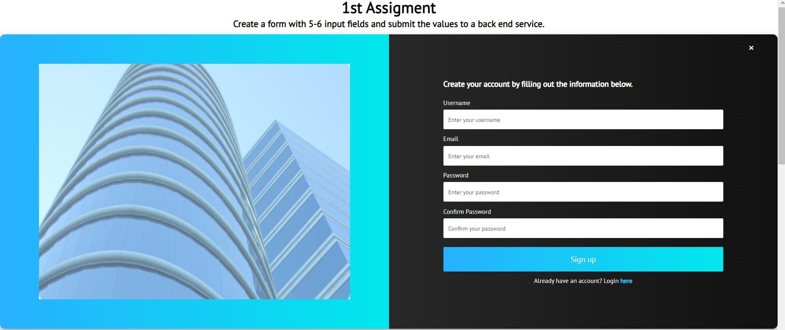
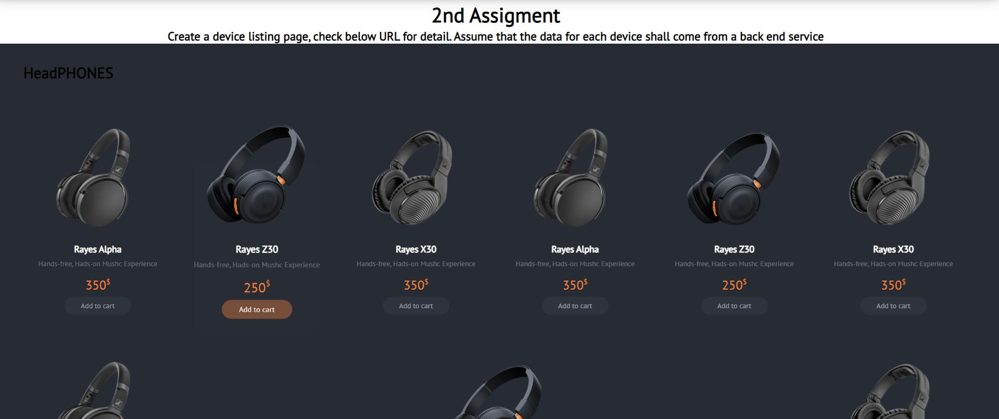
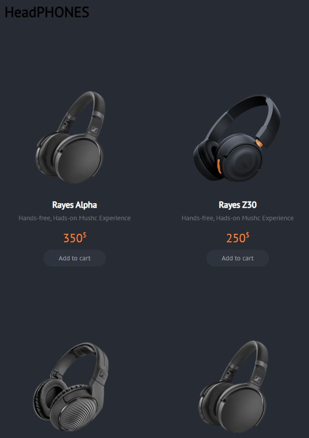

## RECIPE SELECTION PAGE

## OVERVIEW

Need to complete below 2 code challenges:

Please find below POC tasks. You are free to use any of React JS & React Native
(Whichever they are comfortable) for the POC and will be interviewed on that
technology only.

Create a form with 5-6 input fields and submit the values to a back end service.
Create a device listing page, check below URL for detail. Assume that the data
for each device shall come from a back end service

https://www.stc.com.kw/sites/stc/en/devices Note: We are more interested in the
approach rather than a working API integration. You can hardcode the API values
instead of doing an actual integration.

Please try and finish it ASAP so that we cab have a closure BY This week.

**HelloFresh app overview**
  

**Mobile View** 

## SOLUTION

Solution based on React architeture, Implementing custome hooks functionality
for Form Component and Loading JSON data for Product Comonent.

## INSTRUCTIONS

1. Clone this repository
   `git clone https://github.com/dhirendra761/JMTAl-Ghanim-Code-Challenge.git`
2. Install the dependencies using `npm install`
3. Run the dev server `npm start`
4. Then access http://localhost:3000/

## TEST

All the tests are available in same folders around the files. There is unit
tests for the validators and snapshot tests for the components.

To run the tests use: `npm run test`

## FEATURES

- It's a **React SPA** ❤
- **PRODUCT COMPONENTS**:
- Simulated returns static **JSON data**.
- Loaded from JSON instead of API
- **FORM COMPONENTS**
- Used "useForm" hooks.
- Validated inputs fields. User will get error in case of incorrect values.
- You will get response in header after submission.
- Implemented components are tested with **Jest**.

## CONTRIBUTOR

- Dhirendra Singh <dhirendrasingh.822@gmail.com>
